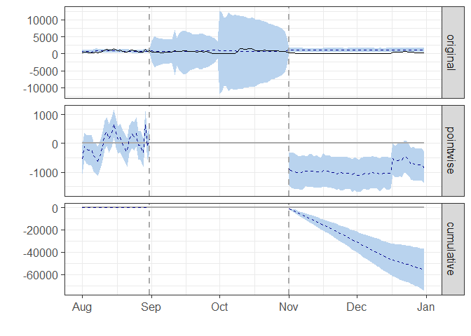
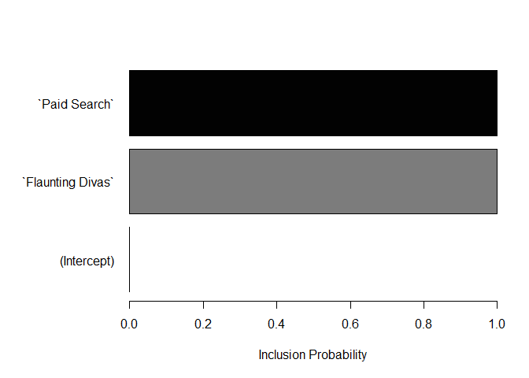

# Introduction

This R Markdown document serves as a guide to introduce users to demonstrating impact of Ads in R with a real example used with Advertising data. 

Consider: https://github.com/klarsen1/MarketMatching

# Required packages

```r
library(CausalImpact)
```

```
## Warning: package 'CausalImpact' was built under R version 3.5.2
```

```
## Loading required package: bsts
```

```
## Warning: package 'bsts' was built under R version 3.5.2
```

```
## Loading required package: BoomSpikeSlab
```

```
## Warning: package 'BoomSpikeSlab' was built under R version 3.5.2
```

```
## Loading required package: Boom
```

```
## Warning: package 'Boom' was built under R version 3.5.2
```

```
## Loading required package: MASS
```

```
## 
## Attaching package: 'Boom'
```

```
## The following object is masked from 'package:stats':
## 
##     rWishart
```

```
## Loading required package: zoo
```

```
## 
## Attaching package: 'zoo'
```

```
## The following objects are masked from 'package:base':
## 
##     as.Date, as.Date.numeric
```

```
## Loading required package: xts
```

```r
library(tidyverse)
```

```
## -- Attaching packages ------------------------------ tidyverse 1.2.1 --
```

```
## v ggplot2 3.0.0     v purrr   0.2.5
## v tibble  2.0.1     v dplyr   0.7.5
## v tidyr   0.8.1     v stringr 1.4.0
## v readr   1.1.1     v forcats 0.4.0
```

```
## Warning: package 'ggplot2' was built under R version 3.5.1
```

```
## Warning: package 'tibble' was built under R version 3.5.2
```

```
## Warning: package 'stringr' was built under R version 3.5.3
```

```
## Warning: package 'forcats' was built under R version 3.5.3
```

```
## -- Conflicts --------------------------------- tidyverse_conflicts() --
## x dplyr::filter() masks stats::filter()
## x dplyr::first()  masks xts::first()
## x dplyr::lag()    masks stats::lag()
## x dplyr::last()   masks xts::last()
## x dplyr::select() masks MASS::select()
```

```r
library(xts)
```

# Import data files


```r
ad_impressions <- read_csv('DV360 ad impressions 20180901-20181231.csv')
```

```
## Parsed with column specification:
## cols(
##   `DV360 Exchange (CM Model)` = col_character(),
##   `DV360 Creative Name (CM Model)` = col_character(),
##   Date = col_integer(),
##   `DV360 Impressions` = col_integer(),
##   Sessions = col_integer()
## )
```

```r
head(ad_impressions)
```

```
## # A tibble: 6 x 5
##   `DV360 Exchange (C~ `DV360 Creative Nam~   Date `DV360 Impressi~ Sessions
##   <chr>               <chr>                 <int>            <int>    <int>
## 1 DoubleClick Ad Exc~ Beauty Addict + Ins~ 2.02e7           521554        4
## 2 DoubleClick Ad Exc~ Beauty Addict + Ins~ 2.02e7           435500        1
## 3 DoubleClick Ad Exc~ Beauty Addict + Ins~ 2.02e7           347243        4
## 4 DoubleClick Ad Exc~ Flaunting Divas      2.02e7           324399        7
## 5 DoubleClick Ad Exc~ Flaunting Divas      2.02e7           314448       12
## 6 DoubleClick Ad Exc~ Beauty Addict + Ins~ 2.02e7           312875        3
```


```r
channel_grouping <- read_csv('Channel Grouping Sessions.csv')
```

```
## Parsed with column specification:
## cols(
##   `Default Channel Grouping` = col_character(),
##   Date = col_integer(),
##   Sessions = col_integer()
## )
```

```r
head(channel_grouping)
```

```
## # A tibble: 6 x 3
##   `Default Channel Grouping`     Date Sessions
##   <chr>                         <int>    <int>
## 1 (Other)                    20180807     5748
## 2 (Other)                    20180808     5175
## 3 (Other)                    20180809     4927
## 4 (Other)                    20180813     4458
## 5 (Other)                    20180810     4411
## 6 (Other)                    20180811     4333
```

Problem Statement: We want to know the impact of K-Addict campaign impressions on the number of sessions on K Bright website

Variables of interest in an experiment (those that are measured or observed) are called response or dependent variables. Other variables in the experiment that affect the response and can be set or measured by the experimenter are called predictor, explanatory, or independent variables. 

For example, you might want to determine the recommended baking time for a cake recipe. 

Predictor variables such as Baking time or oven temperature would affect the response (we would change or optimise these), which could be moisture level or thickness of the cake (the outcome that we would want to measure).

Datasets are obtained from Google Analytics, from 1 September 2018 to 31 December 2018
Response: date, Sessions (1 August 2018 - 31 December 2018) 
First group of users (Predictor 1): date, Impressions of Flaunting Divas campaign (1 Sept 2018 - 31 Oct 2018)
Second group of users (Predictor 2): date, Impressions of K-Bright Visitor campaign (optional)

http://www.dartistics.com/timeseries.html

Channels report: ChannelGrouping, Date, Sessions
Ad Impressions report: DV360 Exchange (CM Model), DV360 Creative Name (CM Model), Date, DV360 Impressions


```r
# Create Date-Time column
ad_impressions$Date <-  as.Date(as.character(ad_impressions$Date),format="%Y%m%d")
#ad_impressions$Date <-  as.POSIXct(ad_impressions$Date, format = "%Y%m/%d", #origin="SGT")

channel_grouping$Date <-  as.Date(as.character(channel_grouping$Date),format="%Y%m%d")
#channel_grouping$Date <-  as.POSIXct(channel_grouping$Date, format = "%Y%m/%d", #origin="SGT")

# Filter for the specific campaign that we want to test
ad_impressions_K_Addict <- ad_impressions %>% 
  filter(`DV360 Exchange (CM Model)` == 'DoubleClick Ad Exchange' &
           `DV360 Creative Name (CM Model)` == 'Flaunting Divas') %>% 
  select(-`DV360 Exchange (CM Model)`)

# remove unwanted columns and join datasets
channel_grouping_wide <- channel_grouping %>% 
  spread(`Default Channel Grouping`, Sessions)

ad_impressions_K_Addict_wide <- ad_impressions_K_Addict %>% 
  spread(`DV360 Creative Name (CM Model)`, `DV360 Impressions`)

channel_ad_impressions <- channel_grouping_wide %>% 
  left_join(ad_impressions_K_Addict_wide, by = 'Date') %>% 
   mutate_at(vars(-Date), funs(replace(., is.na(.), 0)))

channel_ad_impressions_xts <- xts(channel_ad_impressions[-1], order.by = as.Date(channel_ad_impressions$Date))

## data in order of response, predictor1, predictor2, etc.
model_data <- channel_ad_impressions_xts[,c("Display","Flaunting Divas","Paid Search")]
```

# Create Pre & Post Periods


```r
# Determine pre and post event time frames varying post period timepre.period 
pre.period <- as.Date(c("2018-08-01","2018-08-31"))
post.period <- as.Date(c("2018-11-01","2018-12-31"))
```


# Run Causal Impact analysis and see results

```r
impact_channel_ad_impressions_xts = CausalImpact(model_data, pre.period, post.period)
summary(impact_channel_ad_impressions_xts)
```

```
## Posterior inference {CausalImpact}
## 
##                          Average         Cumulative      
## Actual                   171             10418           
## Prediction (s.d.)        1094 (154)      66729 (9387)    
## 95% CI                   [782, 1392]     [47707, 84882]  
##                                                          
## Absolute effect (s.d.)   -923 (154)      -56311 (9387)   
## 95% CI                   [-1221, -611]   [-74464, -37289]
##                                                          
## Relative effect (s.d.)   -84% (14%)      -84% (14%)      
## 95% CI                   [-112%, -56%]   [-112%, -56%]   
## 
## Posterior tail-area probability p:   0.00103
## Posterior prob. of a causal effect:  99.89744%
## 
## For more details, type: summary(impact, "report")
```
# Generate a narrated report of the results

```r
summary(impact_channel_ad_impressions_xts, "report")
```

```
## Analysis report {CausalImpact}
## 
## 
## During the post-intervention period, the response variable had an average value of approx. 170.79. By contrast, in the absence of an intervention, we would have expected an average response of 1093.91. The 95% interval of this counterfactual prediction is [782.09, 1391.52]. Subtracting this prediction from the observed response yields an estimate of the causal effect the intervention had on the response variable. This effect is -923.12 with a 95% interval of [-1220.73, -611.30]. For a discussion of the significance of this effect, see below.
## 
## Summing up the individual data points during the post-intervention period (which can only sometimes be meaningfully interpreted), the response variable had an overall value of 10.42K. By contrast, had the intervention not taken place, we would have expected a sum of 66.73K. The 95% interval of this prediction is [47.71K, 84.88K].
## 
## The above results are given in terms of absolute numbers. In relative terms, the response variable showed a decrease of-84%. The 95% interval of this percentage is [-112%, -56%].
## 
## This means that the negative effect observed during the intervention period is statistically significant. If the experimenter had expected a positive effect, it is recommended to double-check whether anomalies in the control variables may have caused an overly optimistic expectation of what should have happened in the response variable in the absence of the intervention.
## 
## The probability of obtaining this effect by chance is very small (Bayesian one-sided tail-area probability p = 0.001). This means the causal effect can be considered statistically significant.
```

# Plot graphs of the results

```r
plot(impact_channel_ad_impressions_xts)
```

```
## Warning: Removed 153 rows containing missing values (geom_path).
```

```
## Warning: Removed 306 rows containing missing values (geom_path).
```

<!-- -->
Original: Solid, black line is observed data before the intervention and dotted, blue line is the predicted coin in values for what would have occurred without the intervention

Pointwise: The net difference between the observed and predicted response on the original scale, or the difference between the solid, black line and the dotted, blue line on the original graph.

Cumulative: Dotted, blue line is the individual causal effects added up in time, day after day.

For all three graphs, the light blue shaded area represents the results in a 95% confidence level. The farther that the graph extends past the beginning of the intervention, the less certain of the causal effect; hence, the larger the shaded area.

# Show the predictor variables used in the model


```r
plot(impact_channel_ad_impressions_xts$model$bsts.model, "coefficients")
```

<!-- -->

# Further exploration

https://ee.cooper.edu/~keene/assets/Neema_Thesis_vFinal.pdf
