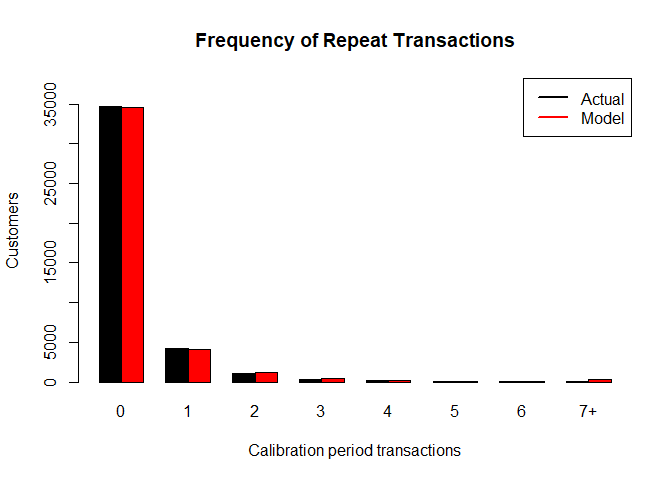
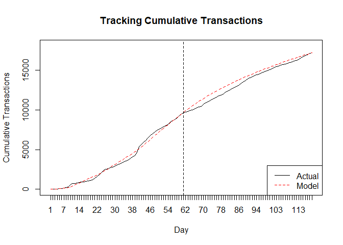
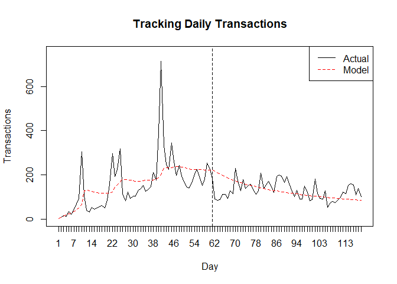
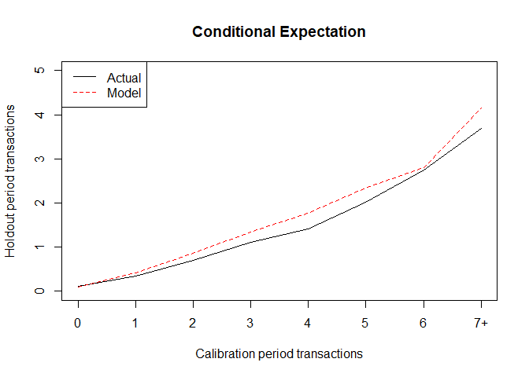
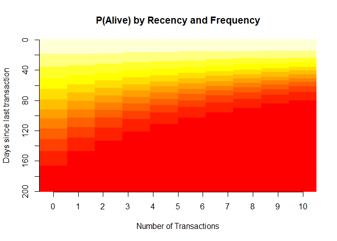
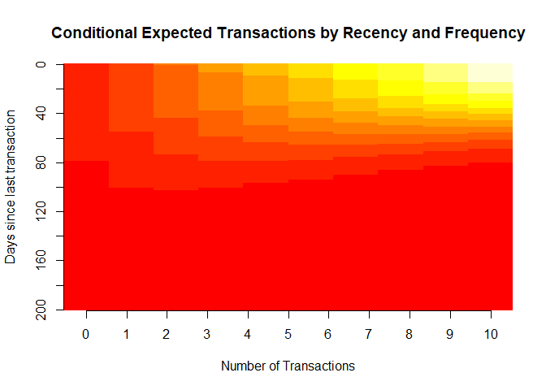
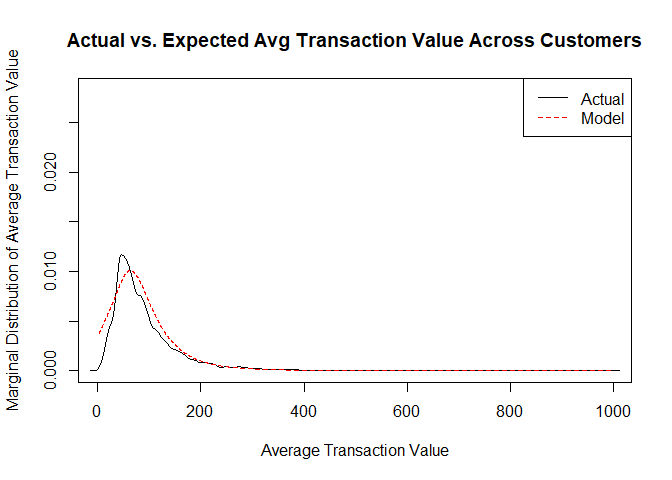

# Things to do
Define the end of calibration period date properly
Try using ZUID instead of fullvisitorid
Try using a longer time period to account for seasonality


# Introduction

This R Markdown document serves as a guide to introduce users to show a POC for LTV

# Required packages

```r
library(tidyverse)
```

```
## -- Attaching packages ------------------------------ tidyverse 1.2.1 --
```

```
## v ggplot2 3.0.0     v purrr   0.2.5
## v tibble  2.0.1     v dplyr   0.7.5
## v tidyr   0.8.1     v stringr 1.4.0
## v readr   1.1.1     v forcats 0.4.0
```

```
## Warning: package 'ggplot2' was built under R version 3.5.1
```

```
## Warning: package 'tibble' was built under R version 3.5.2
```

```
## Warning: package 'stringr' was built under R version 3.5.3
```

```
## Warning: package 'forcats' was built under R version 3.5.3
```

```
## -- Conflicts --------------------------------- tidyverse_conflicts() --
## x dplyr::filter() masks stats::filter()
## x dplyr::lag()    masks stats::lag()
```

```r
library(BTYD)
```

```
## Warning: package 'BTYD' was built under R version 3.5.2
```

```
## Loading required package: hypergeo
```

```
## Warning: package 'hypergeo' was built under R version 3.5.1
```

```r
library(skimr)
```

```
## Warning: package 'skimr' was built under R version 3.5.3
```

```
## 
## Attaching package: 'skimr'
```

```
## The following object is masked from 'package:stats':
## 
##     filter
```

```r
library(bigrquery)
library(DataExplorer)
```

```
## Warning: package 'DataExplorer' was built under R version 3.5.3
```
Find the LTV of the cohort of new visitors between 2018-11-01 and 2018-12-30, for a period between 2018-11-01 and 2019-02-28

The calibration period will be 2 months, ending on 2019-01-01.


```r
start_date = '2018-11-01'
end_date = '2019-02-28'
cohort_end_date = '2018-12-30'
end_of_cal_period = '2019-01-01'

project <- "zsgp-ga-bigq"
targets_dataset <- "94892991"

# get_target_query <- paste0(
#    "SELECT
#   *
# FROM
#   (
#   SELECT
#     date,
#     fullVisitorId as cust,
#     totals.transactionRevenue/1000000 as sales,
#     totals.transactions
#      FROM `zsgp-ga-bigq.94892991.ga_sessions_*`
#     where _TABLE_SUFFIX BETWEEN FORMAT_DATE('%Y%m%d', DATE('", start_date, "'))
#     AND FORMAT_DATE('%Y%m%d', DATE('", end_date, "'))
#   and
#     totals.transactions IS NOT NULL
#     ) a
# JOIN
#   (
#   SELECT
#     fullVisitorId
#   FROM `zsgp-ga-bigq.94892991.ga_sessions_*`
#     where _TABLE_SUFFIX BETWEEN FORMAT_DATE('%Y%m%d', DATE('", start_date, "'))
#     AND FORMAT_DATE('%Y%m%d', DATE('", cohort_end_date, "'))
#   and
#     totals.newVisits IS NOT NULL
#   #  AND RAND() < 1/50
#   GROUP BY
#     1
#     ) b
# ON
#   a.cust=b.fullVisitorId
# ORDER BY
#   date"
#   )
# 
# # new query (used to create csv export from ZSG BQ)
# get_target_query <- paste0(
# "SELECT
#     date,
#     fullVisitorId as cust,
#    sum( totals.transactionRevenue/1000000) as sales,
#     sum(totals.transactions) as transactions
#      FROM `zsgp-ga-bigq.94892991.ga_sessions_*`
#     where _TABLE_SUFFIX BETWEEN FORMAT_DATE('%Y%m%d', DATE('2018-10-01'))
#     AND FORMAT_DATE('%Y%m%d', DATE('2018-12-31'))
#   and
#     totals.transactions IS NOT NULL
#     group by 1,2"
# )
# 
# target_data <-
#   bq_table_download(bq_project_query(project, get_target_query))

#zsg <- read_csv("zsg_bq.csv", col_types = cols(date = #col_character()))

library(fst)
```

```
## Warning: package 'fst' was built under R version 3.5.1
```

```r
# write.fst(target_data, "zsg_btyd.fst")
elog <- read.fst("zsg_btyd.fst")
```

## Get descriptive stats on the dataset

```r
summary(elog)
```

```
##      date               cust               sales          transactions  
##  Length:71172       Length:71172       Min.   :  -6.51   Min.   :1.000  
##  Class :character   Class :character   1st Qu.:  45.97   1st Qu.:1.000  
##  Mode  :character   Mode  :character   Median :  70.56   Median :1.000  
##                                        Mean   :  92.02   Mean   :1.021  
##                                        3rd Qu.: 112.75   3rd Qu.:1.000  
##                                        Max.   :7656.10   Max.   :6.000  
##                                        NA's   :444                      
##  fullVisitorId     
##  Length:71172      
##  Class :character  
##  Mode  :character  
##                    
##                    
##                    
## 
```

```r
skim(elog)
```

```
## Skim summary statistics
##  n obs: 71172 
##  n variables: 5 
## 
## -- Variable type:character --------------------------------------------
##       variable missing complete     n min max empty n_unique
##           cust       0    71172 71172  14  20     0    48674
##           date       0    71172 71172   8   8     0      120
##  fullVisitorId       0    71172 71172  14  20     0    48674
## 
## -- Variable type:integer ----------------------------------------------
##      variable missing complete     n mean   sd p0 p25 p50 p75 p100
##  transactions       0    71172 71172 1.02 0.16  1   1   1   1    6
##      hist
##  <U+2587><U+2581><U+2581><U+2581><U+2581><U+2581><U+2581><U+2581>
## 
## -- Variable type:numeric ----------------------------------------------
##  variable missing complete     n  mean    sd    p0   p25   p50    p75
##     sales     444    70728 71172 92.02 86.48 -6.51 45.97 70.56 112.75
##    p100     hist
##  7656.1 <U+2587><U+2581><U+2581><U+2581><U+2581><U+2581><U+2581><U+2581>
```


## Build a BTYD model

After transforming data, we build a customer-by-sufficient-statistic matrix for the Pareto-NBD model


```r
elog <- elog %>% 
  mutate_at(vars(sales), funs(replace(., is.na(.), 0))) %>% 
  filter(sales > 0)

elog <- data.frame(cust = elog$cust, date = elog$date, sales = elog$sales)
#elog$sales <- elog$sales / 10^6

# format dates
elog$date <- as.Date(elog$date, "%Y%m%d")

# set key dates
end.of.cal.period <- as.Date(end_of_cal_period)
T.end <- max(elog$date)
T.star <- as.numeric(T.end - end.of.cal.period)
T.tot <- as.numeric(max(elog$date) - min(elog$date))

dataset <- dc.ElogToCbsCbt(elog, per="day", 
  T.cal=end.of.cal.period)
```

```
## Started making CBS and CBT from the ELOG...
```

```
## ...Completed Freq CBT
```

```
## Finished filtering out customers not in the birth period.
```

```
## No dissipation requested.
```

```
## Started merging same-date transactions...
```

```
## ... Finished merging same-date transactions.
```

```
## Started Creating Repeat Purchases
```

```
## Finished Creating Repeat Purchases
```

```
## Started Building CBS and CBT for calibration period...
```

```
## Started Building CBT...
```

```
## ...Completed Freq CBT
```

```
## Started Building CBT...
```

```
## ...Completed Freq CBT
```

```
## Started making calibration period CBS...
```

```
## Finished building CBS.
```

```
## Finished building CBS and CBT for calibration period.
```

```
## Started building CBS and CBT for holdout period...
```

```
## Started Building CBT...
```

```
## ...Completed Freq CBT
```

```
## Started making holdout period CBS...
```

```
## Finished building CBS.
```

```
## Finished building CBS and CBT for holdout.
```

```
## ...Finished Making All CBS and CBT
```

```r
# estimate model
# https://stackoverflow.com/questions/26280683/error-btyd-pnbd-estimateparameters-l-bfgs-b-needs-finite-values-of-fn
cal.cbs <- dataset[["cal"]][["cbs"]]
params <- pnbd.EstimateParameters(cal.cbs)
# params <- bgnbd.EstimateParameters(cal.cbs)

print(params)
```

```
## [1]  0.5052077 29.3938157  0.8654923  8.5013315
```


```r
mape <- function(actual, forecasted) {
    n <- length(actual)
    (1/n) * sum(abs((actual - forecasted) / actual))
}

# calculate incremental and cumulative vectors
T.cal <- cal.cbs[,3]
actual.inc.tracking.data <- cbind(dataset[['cal']][['cbt']], 
  dataset[['holdout']][['cbt']])
actual.inc.tracking.data <- apply(actual.inc.tracking.data, 2, sum)
actual.cum.tracking.data <- cumsum(actual.inc.tracking.data)
expected.cum.trans <- pnbd.ExpectedCumulativeTransactions(params, T.cal, T.tot, length(actual.cum.tracking.data))

# find end of calibration date
end.of.cal.day <- as.numeric(end.of.cal.period - min(elog$date))

total.mape <- mape(actual.cum.tracking.data, expected.cum.trans)
in.sample.mape <- mape(actual.cum.tracking.data[1:end.of.cal.day], expected.cum.trans[1:end.of.cal.day])
out.of.sample.mape <- mape(actual.cum.tracking.data[end.of.cal.day:T.tot], expected.cum.trans[end.of.cal.day:T.tot])
mape.outputs <- data.frame("MAPE"=c(in.sample.mape, out.of.sample.mape, total.mape))
row.names(mape.outputs) <- c("In sample", "Out of sample", "Total")
print(mape.outputs)
```

```
##                     MAPE
## In sample     0.09972170
## Out of sample 0.03640705
## Total         0.06911771
```


# Analyse the model


```r
print(round(pnbd.Expectation(params, t=365), digits=1))
```

```
## [1] 0.7
```

```r
pnbd.PlotFrequencyInCalibration(params, cal.cbs, 7)
```

<!-- -->

```
##                freq.0  freq.1   freq.2   freq.3   freq.4   freq.5   freq.6
## n.x.actual   34721.00 4285.00 1135.000 372.0000 159.0000 78.00000 40.00000
## n.x.expected 34563.87 4093.93 1153.846 436.6851 191.7343 92.05402 46.90505
##               freq.7+
## n.x.actual    73.0000
## n.x.expected 283.9761
```

# 


```r
# cumulative tracking
cum.tracking <- pnbd.PlotTrackingCum(params, T.cal, T.tot,
  actual.cum.tracking.data, xlab="Day")
```

<!-- -->


```r
# inc tracking
inc.tracking <- pnbd.PlotTrackingInc(params, T.cal, T.tot, 
  actual.inc.tracking.data, xlab="Day", title="Tracking Daily Transactions")
```

<!-- -->


```r
x.star <- dataset$holdout$cbs[,1]
censor <- 7
cond.expectation <- pnbd.PlotFreqVsConditionalExpectedFrequency(params,
    T.star, cal.cbs, dataset$holdout$cbs[,1], censor)
```

<!-- -->

```r
cond.expectation
```

```
##                            freq.0       freq.1       freq.2     freq.3
## transaction.actual   1.183146e-01    0.3463244    0.7083700   1.102151
## transaction.expected 9.489547e-02    0.4223034    0.8524089   1.348768
## bin.size             3.472100e+04 4285.0000000 1135.0000000 372.000000
##                          freq.4    freq.5   freq.6  freq.7+
## transaction.actual     1.415094  2.025641  2.75000  3.69863
## transaction.expected   1.771401  2.340468  2.80119  4.16200
## bin.size             159.000000 78.000000 40.00000 73.00000
```


```r
heatmap.palive.data <- matrix(NA, nrow=10, ncol=200)
heatmap.cet.data <- matrix(NA, nrow=10, ncol=200)
for(i in 1:10) {
    heatmap.cet.data[i,] <- pnbd.ConditionalExpectedTransactions(params, T.star=365, x=i, t.x=1:200, T.cal=200)
    heatmap.palive.data[i,] <- pnbd.PAlive(params, x=i, t.x=1:200, T.cal=200)
}
image(heatmap.palive.data, axes=FALSE, xlab="Number of Transactions", ylab="Days since last transaction", main="P(Alive) by Recency and Frequency")
axis(1, at=seq(0,1,.1), labels=0:10)
axis(2, at=seq(0,1,.1), labels=seq(200,0,-20))
```

<!-- -->

```r
image(heatmap.cet.data, axes=FALSE, xlab="Number of Transactions", ylab="Days since last transaction", main="Conditional Expected Transactions by Recency and Frequency")
axis(1, at=seq(0,1,.1), labels=0:10)
axis(2, at=seq(0,1,.1), labels=seq(200,0,-20))
```

<!-- -->

# Forecasting Spend

```r
#cal.cbt <- dc.CreateSpendCBT(elog, is.avg.spend = FALSE)
cal.cbt <- dc.ElogToCbsCbt(elog, per="day", T.cal=end.of.cal.period, cohort.birth.per=as.Date(cohort_end_date), statistic="total.spend")
```

```
## Started making CBS and CBT from the ELOG...
```

```
## ...Completed Freq CBT
```

```
## Finished filtering out customers not in the birth period.
```

```
## No dissipation requested.
```

```
## Started merging same-date transactions...
```

```
## ... Finished merging same-date transactions.
```

```
## Started Creating Repeat Purchases
```

```
## Finished Creating Repeat Purchases
```

```
## Started Building CBS and CBT for calibration period...
```

```
## Started Building CBT...
```

```
## ...Completed Spend CBT
```

```
## Started Building CBT...
```

```
## ...Completed Spend CBT
```

```
## Started making calibration period CBS...
```

```
## Finished building CBS.
```

```
## Finished building CBS and CBT for calibration period.
```

```
## Started building CBS and CBT for holdout period...
```

```
## Started Building CBT...
```

```
## ...Completed Spend CBT
```

```
## Started making holdout period CBS...
```

```
## Finished building CBS.
```

```
## Finished building CBS and CBT for holdout.
```

```
## ...Finished Making All CBS and CBT
```

```r
cal.cbs <- cal.cbt$cal$cbs
cal.cbt <- cal.cbt$cal$cbt
calculateAvgSpend <- function(cbt.row) {
    purchaseCols = which(cbt.row != 0)
    sum(cbt.row[purchaseCols]) / length(purchaseCols)
}

m.x <- apply(cal.cbt, 1, calculateAvgSpend)
m.x[which(is.na(m.x))] <- 0
spendParams <- spend.EstimateParameters(m.x, cal.cbs[,1])
```

```
## Warning in spend.EstimateParameters(m.x, cal.cbs[, 1]): Customers with 0
## transactions or 0 average spend in spend.LL
```

```
## Warning in spend.LL(params, m.x.vector, x.vector): Customers with 0
## transactions or 0 average spend in spend.LL

## Warning in spend.LL(params, m.x.vector, x.vector): Customers with 0
## transactions or 0 average spend in spend.LL

## Warning in spend.LL(params, m.x.vector, x.vector): Customers with 0
## transactions or 0 average spend in spend.LL

## Warning in spend.LL(params, m.x.vector, x.vector): Customers with 0
## transactions or 0 average spend in spend.LL

## Warning in spend.LL(params, m.x.vector, x.vector): Customers with 0
## transactions or 0 average spend in spend.LL

## Warning in spend.LL(params, m.x.vector, x.vector): Customers with 0
## transactions or 0 average spend in spend.LL

## Warning in spend.LL(params, m.x.vector, x.vector): Customers with 0
## transactions or 0 average spend in spend.LL

## Warning in spend.LL(params, m.x.vector, x.vector): Customers with 0
## transactions or 0 average spend in spend.LL

## Warning in spend.LL(params, m.x.vector, x.vector): Customers with 0
## transactions or 0 average spend in spend.LL

## Warning in spend.LL(params, m.x.vector, x.vector): Customers with 0
## transactions or 0 average spend in spend.LL

## Warning in spend.LL(params, m.x.vector, x.vector): Customers with 0
## transactions or 0 average spend in spend.LL

## Warning in spend.LL(params, m.x.vector, x.vector): Customers with 0
## transactions or 0 average spend in spend.LL

## Warning in spend.LL(params, m.x.vector, x.vector): Customers with 0
## transactions or 0 average spend in spend.LL

## Warning in spend.LL(params, m.x.vector, x.vector): Customers with 0
## transactions or 0 average spend in spend.LL

## Warning in spend.LL(params, m.x.vector, x.vector): Customers with 0
## transactions or 0 average spend in spend.LL

## Warning in spend.LL(params, m.x.vector, x.vector): Customers with 0
## transactions or 0 average spend in spend.LL

## Warning in spend.LL(params, m.x.vector, x.vector): Customers with 0
## transactions or 0 average spend in spend.LL

## Warning in spend.LL(params, m.x.vector, x.vector): Customers with 0
## transactions or 0 average spend in spend.LL

## Warning in spend.LL(params, m.x.vector, x.vector): Customers with 0
## transactions or 0 average spend in spend.LL

## Warning in spend.LL(params, m.x.vector, x.vector): Customers with 0
## transactions or 0 average spend in spend.LL

## Warning in spend.LL(params, m.x.vector, x.vector): Customers with 0
## transactions or 0 average spend in spend.LL

## Warning in spend.LL(params, m.x.vector, x.vector): Customers with 0
## transactions or 0 average spend in spend.LL

## Warning in spend.LL(params, m.x.vector, x.vector): Customers with 0
## transactions or 0 average spend in spend.LL

## Warning in spend.LL(params, m.x.vector, x.vector): Customers with 0
## transactions or 0 average spend in spend.LL

## Warning in spend.LL(params, m.x.vector, x.vector): Customers with 0
## transactions or 0 average spend in spend.LL

## Warning in spend.LL(params, m.x.vector, x.vector): Customers with 0
## transactions or 0 average spend in spend.LL

## Warning in spend.LL(params, m.x.vector, x.vector): Customers with 0
## transactions or 0 average spend in spend.LL

## Warning in spend.LL(params, m.x.vector, x.vector): Customers with 0
## transactions or 0 average spend in spend.LL

## Warning in spend.LL(params, m.x.vector, x.vector): Customers with 0
## transactions or 0 average spend in spend.LL

## Warning in spend.LL(params, m.x.vector, x.vector): Customers with 0
## transactions or 0 average spend in spend.LL

## Warning in spend.LL(params, m.x.vector, x.vector): Customers with 0
## transactions or 0 average spend in spend.LL

## Warning in spend.LL(params, m.x.vector, x.vector): Customers with 0
## transactions or 0 average spend in spend.LL

## Warning in spend.LL(params, m.x.vector, x.vector): Customers with 0
## transactions or 0 average spend in spend.LL

## Warning in spend.LL(params, m.x.vector, x.vector): Customers with 0
## transactions or 0 average spend in spend.LL

## Warning in spend.LL(params, m.x.vector, x.vector): Customers with 0
## transactions or 0 average spend in spend.LL

## Warning in spend.LL(params, m.x.vector, x.vector): Customers with 0
## transactions or 0 average spend in spend.LL

## Warning in spend.LL(params, m.x.vector, x.vector): Customers with 0
## transactions or 0 average spend in spend.LL

## Warning in spend.LL(params, m.x.vector, x.vector): Customers with 0
## transactions or 0 average spend in spend.LL

## Warning in spend.LL(params, m.x.vector, x.vector): Customers with 0
## transactions or 0 average spend in spend.LL

## Warning in spend.LL(params, m.x.vector, x.vector): Customers with 0
## transactions or 0 average spend in spend.LL

## Warning in spend.LL(params, m.x.vector, x.vector): Customers with 0
## transactions or 0 average spend in spend.LL

## Warning in spend.LL(params, m.x.vector, x.vector): Customers with 0
## transactions or 0 average spend in spend.LL

## Warning in spend.LL(params, m.x.vector, x.vector): Customers with 0
## transactions or 0 average spend in spend.LL

## Warning in spend.LL(params, m.x.vector, x.vector): Customers with 0
## transactions or 0 average spend in spend.LL

## Warning in spend.LL(params, m.x.vector, x.vector): Customers with 0
## transactions or 0 average spend in spend.LL

## Warning in spend.LL(params, m.x.vector, x.vector): Customers with 0
## transactions or 0 average spend in spend.LL

## Warning in spend.LL(params, m.x.vector, x.vector): Customers with 0
## transactions or 0 average spend in spend.LL

## Warning in spend.LL(params, m.x.vector, x.vector): Customers with 0
## transactions or 0 average spend in spend.LL

## Warning in spend.LL(params, m.x.vector, x.vector): Customers with 0
## transactions or 0 average spend in spend.LL

## Warning in spend.LL(params, m.x.vector, x.vector): Customers with 0
## transactions or 0 average spend in spend.LL

## Warning in spend.LL(params, m.x.vector, x.vector): Customers with 0
## transactions or 0 average spend in spend.LL

## Warning in spend.LL(params, m.x.vector, x.vector): Customers with 0
## transactions or 0 average spend in spend.LL

## Warning in spend.LL(params, m.x.vector, x.vector): Customers with 0
## transactions or 0 average spend in spend.LL

## Warning in spend.LL(params, m.x.vector, x.vector): Customers with 0
## transactions or 0 average spend in spend.LL

## Warning in spend.LL(params, m.x.vector, x.vector): Customers with 0
## transactions or 0 average spend in spend.LL

## Warning in spend.LL(params, m.x.vector, x.vector): Customers with 0
## transactions or 0 average spend in spend.LL

## Warning in spend.LL(params, m.x.vector, x.vector): Customers with 0
## transactions or 0 average spend in spend.LL

## Warning in spend.LL(params, m.x.vector, x.vector): Customers with 0
## transactions or 0 average spend in spend.LL

## Warning in spend.LL(params, m.x.vector, x.vector): Customers with 0
## transactions or 0 average spend in spend.LL

## Warning in spend.LL(params, m.x.vector, x.vector): Customers with 0
## transactions or 0 average spend in spend.LL

## Warning in spend.LL(params, m.x.vector, x.vector): Customers with 0
## transactions or 0 average spend in spend.LL

## Warning in spend.LL(params, m.x.vector, x.vector): Customers with 0
## transactions or 0 average spend in spend.LL

## Warning in spend.LL(params, m.x.vector, x.vector): Customers with 0
## transactions or 0 average spend in spend.LL

## Warning in spend.LL(params, m.x.vector, x.vector): Customers with 0
## transactions or 0 average spend in spend.LL

## Warning in spend.LL(params, m.x.vector, x.vector): Customers with 0
## transactions or 0 average spend in spend.LL

## Warning in spend.LL(params, m.x.vector, x.vector): Customers with 0
## transactions or 0 average spend in spend.LL

## Warning in spend.LL(params, m.x.vector, x.vector): Customers with 0
## transactions or 0 average spend in spend.LL

## Warning in spend.LL(params, m.x.vector, x.vector): Customers with 0
## transactions or 0 average spend in spend.LL

## Warning in spend.LL(params, m.x.vector, x.vector): Customers with 0
## transactions or 0 average spend in spend.LL

## Warning in spend.LL(params, m.x.vector, x.vector): Customers with 0
## transactions or 0 average spend in spend.LL

## Warning in spend.LL(params, m.x.vector, x.vector): Customers with 0
## transactions or 0 average spend in spend.LL

## Warning in spend.LL(params, m.x.vector, x.vector): Customers with 0
## transactions or 0 average spend in spend.LL

## Warning in spend.LL(params, m.x.vector, x.vector): Customers with 0
## transactions or 0 average spend in spend.LL

## Warning in spend.LL(params, m.x.vector, x.vector): Customers with 0
## transactions or 0 average spend in spend.LL

## Warning in spend.LL(params, m.x.vector, x.vector): Customers with 0
## transactions or 0 average spend in spend.LL

## Warning in spend.LL(params, m.x.vector, x.vector): Customers with 0
## transactions or 0 average spend in spend.LL

## Warning in spend.LL(params, m.x.vector, x.vector): Customers with 0
## transactions or 0 average spend in spend.LL

## Warning in spend.LL(params, m.x.vector, x.vector): Customers with 0
## transactions or 0 average spend in spend.LL

## Warning in spend.LL(params, m.x.vector, x.vector): Customers with 0
## transactions or 0 average spend in spend.LL

## Warning in spend.LL(params, m.x.vector, x.vector): Customers with 0
## transactions or 0 average spend in spend.LL

## Warning in spend.LL(params, m.x.vector, x.vector): Customers with 0
## transactions or 0 average spend in spend.LL

## Warning in spend.LL(params, m.x.vector, x.vector): Customers with 0
## transactions or 0 average spend in spend.LL

## Warning in spend.LL(params, m.x.vector, x.vector): Customers with 0
## transactions or 0 average spend in spend.LL

## Warning in spend.LL(params, m.x.vector, x.vector): Customers with 0
## transactions or 0 average spend in spend.LL

## Warning in spend.LL(params, m.x.vector, x.vector): Customers with 0
## transactions or 0 average spend in spend.LL

## Warning in spend.LL(params, m.x.vector, x.vector): Customers with 0
## transactions or 0 average spend in spend.LL

## Warning in spend.LL(params, m.x.vector, x.vector): Customers with 0
## transactions or 0 average spend in spend.LL

## Warning in spend.LL(params, m.x.vector, x.vector): Customers with 0
## transactions or 0 average spend in spend.LL

## Warning in spend.LL(params, m.x.vector, x.vector): Customers with 0
## transactions or 0 average spend in spend.LL

## Warning in spend.LL(params, m.x.vector, x.vector): Customers with 0
## transactions or 0 average spend in spend.LL

## Warning in spend.LL(params, m.x.vector, x.vector): Customers with 0
## transactions or 0 average spend in spend.LL

## Warning in spend.LL(params, m.x.vector, x.vector): Customers with 0
## transactions or 0 average spend in spend.LL

## Warning in spend.LL(params, m.x.vector, x.vector): Customers with 0
## transactions or 0 average spend in spend.LL

## Warning in spend.LL(params, m.x.vector, x.vector): Customers with 0
## transactions or 0 average spend in spend.LL

## Warning in spend.LL(params, m.x.vector, x.vector): Customers with 0
## transactions or 0 average spend in spend.LL

## Warning in spend.LL(params, m.x.vector, x.vector): Customers with 0
## transactions or 0 average spend in spend.LL

## Warning in spend.LL(params, m.x.vector, x.vector): Customers with 0
## transactions or 0 average spend in spend.LL

## Warning in spend.LL(params, m.x.vector, x.vector): Customers with 0
## transactions or 0 average spend in spend.LL

## Warning in spend.LL(params, m.x.vector, x.vector): Customers with 0
## transactions or 0 average spend in spend.LL

## Warning in spend.LL(params, m.x.vector, x.vector): Customers with 0
## transactions or 0 average spend in spend.LL

## Warning in spend.LL(params, m.x.vector, x.vector): Customers with 0
## transactions or 0 average spend in spend.LL

## Warning in spend.LL(params, m.x.vector, x.vector): Customers with 0
## transactions or 0 average spend in spend.LL

## Warning in spend.LL(params, m.x.vector, x.vector): Customers with 0
## transactions or 0 average spend in spend.LL

## Warning in spend.LL(params, m.x.vector, x.vector): Customers with 0
## transactions or 0 average spend in spend.LL

## Warning in spend.LL(params, m.x.vector, x.vector): Customers with 0
## transactions or 0 average spend in spend.LL

## Warning in spend.LL(params, m.x.vector, x.vector): Customers with 0
## transactions or 0 average spend in spend.LL

## Warning in spend.LL(params, m.x.vector, x.vector): Customers with 0
## transactions or 0 average spend in spend.LL

## Warning in spend.LL(params, m.x.vector, x.vector): Customers with 0
## transactions or 0 average spend in spend.LL

## Warning in spend.LL(params, m.x.vector, x.vector): Customers with 0
## transactions or 0 average spend in spend.LL

## Warning in spend.LL(params, m.x.vector, x.vector): Customers with 0
## transactions or 0 average spend in spend.LL

## Warning in spend.LL(params, m.x.vector, x.vector): Customers with 0
## transactions or 0 average spend in spend.LL

## Warning in spend.LL(params, m.x.vector, x.vector): Customers with 0
## transactions or 0 average spend in spend.LL

## Warning in spend.LL(params, m.x.vector, x.vector): Customers with 0
## transactions or 0 average spend in spend.LL

## Warning in spend.LL(params, m.x.vector, x.vector): Customers with 0
## transactions or 0 average spend in spend.LL

## Warning in spend.LL(params, m.x.vector, x.vector): Customers with 0
## transactions or 0 average spend in spend.LL

## Warning in spend.LL(params, m.x.vector, x.vector): Customers with 0
## transactions or 0 average spend in spend.LL

## Warning in spend.LL(params, m.x.vector, x.vector): Customers with 0
## transactions or 0 average spend in spend.LL

## Warning in spend.LL(params, m.x.vector, x.vector): Customers with 0
## transactions or 0 average spend in spend.LL

## Warning in spend.LL(params, m.x.vector, x.vector): Customers with 0
## transactions or 0 average spend in spend.LL

## Warning in spend.LL(params, m.x.vector, x.vector): Customers with 0
## transactions or 0 average spend in spend.LL

## Warning in spend.LL(params, m.x.vector, x.vector): Customers with 0
## transactions or 0 average spend in spend.LL

## Warning in spend.LL(params, m.x.vector, x.vector): Customers with 0
## transactions or 0 average spend in spend.LL

## Warning in spend.LL(params, m.x.vector, x.vector): Customers with 0
## transactions or 0 average spend in spend.LL

## Warning in spend.LL(params, m.x.vector, x.vector): Customers with 0
## transactions or 0 average spend in spend.LL

## Warning in spend.LL(params, m.x.vector, x.vector): Customers with 0
## transactions or 0 average spend in spend.LL

## Warning in spend.LL(params, m.x.vector, x.vector): Customers with 0
## transactions or 0 average spend in spend.LL

## Warning in spend.LL(params, m.x.vector, x.vector): Customers with 0
## transactions or 0 average spend in spend.LL

## Warning in spend.LL(params, m.x.vector, x.vector): Customers with 0
## transactions or 0 average spend in spend.LL

## Warning in spend.LL(params, m.x.vector, x.vector): Customers with 0
## transactions or 0 average spend in spend.LL

## Warning in spend.LL(params, m.x.vector, x.vector): Customers with 0
## transactions or 0 average spend in spend.LL

## Warning in spend.LL(params, m.x.vector, x.vector): Customers with 0
## transactions or 0 average spend in spend.LL

## Warning in spend.LL(params, m.x.vector, x.vector): Customers with 0
## transactions or 0 average spend in spend.LL

## Warning in spend.LL(params, m.x.vector, x.vector): Customers with 0
## transactions or 0 average spend in spend.LL

## Warning in spend.LL(params, m.x.vector, x.vector): Customers with 0
## transactions or 0 average spend in spend.LL

## Warning in spend.LL(params, m.x.vector, x.vector): Customers with 0
## transactions or 0 average spend in spend.LL

## Warning in spend.LL(params, m.x.vector, x.vector): Customers with 0
## transactions or 0 average spend in spend.LL

## Warning in spend.LL(params, m.x.vector, x.vector): Customers with 0
## transactions or 0 average spend in spend.LL

## Warning in spend.LL(params, m.x.vector, x.vector): Customers with 0
## transactions or 0 average spend in spend.LL

## Warning in spend.LL(params, m.x.vector, x.vector): Customers with 0
## transactions or 0 average spend in spend.LL

## Warning in spend.LL(params, m.x.vector, x.vector): Customers with 0
## transactions or 0 average spend in spend.LL

## Warning in spend.LL(params, m.x.vector, x.vector): Customers with 0
## transactions or 0 average spend in spend.LL

## Warning in spend.LL(params, m.x.vector, x.vector): Customers with 0
## transactions or 0 average spend in spend.LL

## Warning in spend.LL(params, m.x.vector, x.vector): Customers with 0
## transactions or 0 average spend in spend.LL

## Warning in spend.LL(params, m.x.vector, x.vector): Customers with 0
## transactions or 0 average spend in spend.LL

## Warning in spend.LL(params, m.x.vector, x.vector): Customers with 0
## transactions or 0 average spend in spend.LL

## Warning in spend.LL(params, m.x.vector, x.vector): Customers with 0
## transactions or 0 average spend in spend.LL

## Warning in spend.LL(params, m.x.vector, x.vector): Customers with 0
## transactions or 0 average spend in spend.LL

## Warning in spend.LL(params, m.x.vector, x.vector): Customers with 0
## transactions or 0 average spend in spend.LL

## Warning in spend.LL(params, m.x.vector, x.vector): Customers with 0
## transactions or 0 average spend in spend.LL

## Warning in spend.LL(params, m.x.vector, x.vector): Customers with 0
## transactions or 0 average spend in spend.LL

## Warning in spend.LL(params, m.x.vector, x.vector): Customers with 0
## transactions or 0 average spend in spend.LL

## Warning in spend.LL(params, m.x.vector, x.vector): Customers with 0
## transactions or 0 average spend in spend.LL

## Warning in spend.LL(params, m.x.vector, x.vector): Customers with 0
## transactions or 0 average spend in spend.LL

## Warning in spend.LL(params, m.x.vector, x.vector): Customers with 0
## transactions or 0 average spend in spend.LL

## Warning in spend.LL(params, m.x.vector, x.vector): Customers with 0
## transactions or 0 average spend in spend.LL

## Warning in spend.LL(params, m.x.vector, x.vector): Customers with 0
## transactions or 0 average spend in spend.LL

## Warning in spend.LL(params, m.x.vector, x.vector): Customers with 0
## transactions or 0 average spend in spend.LL

## Warning in spend.LL(params, m.x.vector, x.vector): Customers with 0
## transactions or 0 average spend in spend.LL

## Warning in spend.LL(params, m.x.vector, x.vector): Customers with 0
## transactions or 0 average spend in spend.LL

## Warning in spend.LL(params, m.x.vector, x.vector): Customers with 0
## transactions or 0 average spend in spend.LL

## Warning in spend.LL(params, m.x.vector, x.vector): Customers with 0
## transactions or 0 average spend in spend.LL

## Warning in spend.LL(params, m.x.vector, x.vector): Customers with 0
## transactions or 0 average spend in spend.LL

## Warning in spend.LL(params, m.x.vector, x.vector): Customers with 0
## transactions or 0 average spend in spend.LL

## Warning in spend.LL(params, m.x.vector, x.vector): Customers with 0
## transactions or 0 average spend in spend.LL

## Warning in spend.LL(params, m.x.vector, x.vector): Customers with 0
## transactions or 0 average spend in spend.LL

## Warning in spend.LL(params, m.x.vector, x.vector): Customers with 0
## transactions or 0 average spend in spend.LL

## Warning in spend.LL(params, m.x.vector, x.vector): Customers with 0
## transactions or 0 average spend in spend.LL

## Warning in spend.LL(params, m.x.vector, x.vector): Customers with 0
## transactions or 0 average spend in spend.LL

## Warning in spend.LL(params, m.x.vector, x.vector): Customers with 0
## transactions or 0 average spend in spend.LL

## Warning in spend.LL(params, m.x.vector, x.vector): Customers with 0
## transactions or 0 average spend in spend.LL

## Warning in spend.LL(params, m.x.vector, x.vector): Customers with 0
## transactions or 0 average spend in spend.LL

## Warning in spend.LL(params, m.x.vector, x.vector): Customers with 0
## transactions or 0 average spend in spend.LL

## Warning in spend.LL(params, m.x.vector, x.vector): Customers with 0
## transactions or 0 average spend in spend.LL

## Warning in spend.LL(params, m.x.vector, x.vector): Customers with 0
## transactions or 0 average spend in spend.LL

## Warning in spend.LL(params, m.x.vector, x.vector): Customers with 0
## transactions or 0 average spend in spend.LL

## Warning in spend.LL(params, m.x.vector, x.vector): Customers with 0
## transactions or 0 average spend in spend.LL

## Warning in spend.LL(params, m.x.vector, x.vector): Customers with 0
## transactions or 0 average spend in spend.LL

## Warning in spend.LL(params, m.x.vector, x.vector): Customers with 0
## transactions or 0 average spend in spend.LL

## Warning in spend.LL(params, m.x.vector, x.vector): Customers with 0
## transactions or 0 average spend in spend.LL

## Warning in spend.LL(params, m.x.vector, x.vector): Customers with 0
## transactions or 0 average spend in spend.LL

## Warning in spend.LL(params, m.x.vector, x.vector): Customers with 0
## transactions or 0 average spend in spend.LL

## Warning in spend.LL(params, m.x.vector, x.vector): Customers with 0
## transactions or 0 average spend in spend.LL

## Warning in spend.LL(params, m.x.vector, x.vector): Customers with 0
## transactions or 0 average spend in spend.LL

## Warning in spend.LL(params, m.x.vector, x.vector): Customers with 0
## transactions or 0 average spend in spend.LL

## Warning in spend.LL(params, m.x.vector, x.vector): Customers with 0
## transactions or 0 average spend in spend.LL

## Warning in spend.LL(params, m.x.vector, x.vector): Customers with 0
## transactions or 0 average spend in spend.LL

## Warning in spend.LL(params, m.x.vector, x.vector): Customers with 0
## transactions or 0 average spend in spend.LL

## Warning in spend.LL(params, m.x.vector, x.vector): Customers with 0
## transactions or 0 average spend in spend.LL

## Warning in spend.LL(params, m.x.vector, x.vector): Customers with 0
## transactions or 0 average spend in spend.LL

## Warning in spend.LL(params, m.x.vector, x.vector): Customers with 0
## transactions or 0 average spend in spend.LL

## Warning in spend.LL(params, m.x.vector, x.vector): Customers with 0
## transactions or 0 average spend in spend.LL

## Warning in spend.LL(params, m.x.vector, x.vector): Customers with 0
## transactions or 0 average spend in spend.LL

## Warning in spend.LL(params, m.x.vector, x.vector): Customers with 0
## transactions or 0 average spend in spend.LL

## Warning in spend.LL(params, m.x.vector, x.vector): Customers with 0
## transactions or 0 average spend in spend.LL

## Warning in spend.LL(params, m.x.vector, x.vector): Customers with 0
## transactions or 0 average spend in spend.LL

## Warning in spend.LL(params, m.x.vector, x.vector): Customers with 0
## transactions or 0 average spend in spend.LL

## Warning in spend.LL(params, m.x.vector, x.vector): Customers with 0
## transactions or 0 average spend in spend.LL

## Warning in spend.LL(params, m.x.vector, x.vector): Customers with 0
## transactions or 0 average spend in spend.LL

## Warning in spend.LL(params, m.x.vector, x.vector): Customers with 0
## transactions or 0 average spend in spend.LL

## Warning in spend.LL(params, m.x.vector, x.vector): Customers with 0
## transactions or 0 average spend in spend.LL

## Warning in spend.LL(params, m.x.vector, x.vector): Customers with 0
## transactions or 0 average spend in spend.LL

## Warning in spend.LL(params, m.x.vector, x.vector): Customers with 0
## transactions or 0 average spend in spend.LL

## Warning in spend.LL(params, m.x.vector, x.vector): Customers with 0
## transactions or 0 average spend in spend.LL

## Warning in spend.LL(params, m.x.vector, x.vector): Customers with 0
## transactions or 0 average spend in spend.LL

## Warning in spend.LL(params, m.x.vector, x.vector): Customers with 0
## transactions or 0 average spend in spend.LL

## Warning in spend.LL(params, m.x.vector, x.vector): Customers with 0
## transactions or 0 average spend in spend.LL

## Warning in spend.LL(params, m.x.vector, x.vector): Customers with 0
## transactions or 0 average spend in spend.LL

## Warning in spend.LL(params, m.x.vector, x.vector): Customers with 0
## transactions or 0 average spend in spend.LL

## Warning in spend.LL(params, m.x.vector, x.vector): Customers with 0
## transactions or 0 average spend in spend.LL

## Warning in spend.LL(params, m.x.vector, x.vector): Customers with 0
## transactions or 0 average spend in spend.LL

## Warning in spend.LL(params, m.x.vector, x.vector): Customers with 0
## transactions or 0 average spend in spend.LL

## Warning in spend.LL(params, m.x.vector, x.vector): Customers with 0
## transactions or 0 average spend in spend.LL

## Warning in spend.LL(params, m.x.vector, x.vector): Customers with 0
## transactions or 0 average spend in spend.LL

## Warning in spend.LL(params, m.x.vector, x.vector): Customers with 0
## transactions or 0 average spend in spend.LL

## Warning in spend.LL(params, m.x.vector, x.vector): Customers with 0
## transactions or 0 average spend in spend.LL

## Warning in spend.LL(params, m.x.vector, x.vector): Customers with 0
## transactions or 0 average spend in spend.LL

## Warning in spend.LL(params, m.x.vector, x.vector): Customers with 0
## transactions or 0 average spend in spend.LL

## Warning in spend.LL(params, m.x.vector, x.vector): Customers with 0
## transactions or 0 average spend in spend.LL

## Warning in spend.LL(params, m.x.vector, x.vector): Customers with 0
## transactions or 0 average spend in spend.LL

## Warning in spend.LL(params, m.x.vector, x.vector): Customers with 0
## transactions or 0 average spend in spend.LL

## Warning in spend.LL(params, m.x.vector, x.vector): Customers with 0
## transactions or 0 average spend in spend.LL

## Warning in spend.LL(params, m.x.vector, x.vector): Customers with 0
## transactions or 0 average spend in spend.LL

## Warning in spend.LL(params, m.x.vector, x.vector): Customers with 0
## transactions or 0 average spend in spend.LL

## Warning in spend.LL(params, m.x.vector, x.vector): Customers with 0
## transactions or 0 average spend in spend.LL

## Warning in spend.LL(params, m.x.vector, x.vector): Customers with 0
## transactions or 0 average spend in spend.LL

## Warning in spend.LL(params, m.x.vector, x.vector): Customers with 0
## transactions or 0 average spend in spend.LL

## Warning in spend.LL(params, m.x.vector, x.vector): Customers with 0
## transactions or 0 average spend in spend.LL

## Warning in spend.LL(params, m.x.vector, x.vector): Customers with 0
## transactions or 0 average spend in spend.LL

## Warning in spend.LL(params, m.x.vector, x.vector): Customers with 0
## transactions or 0 average spend in spend.LL

## Warning in spend.LL(params, m.x.vector, x.vector): Customers with 0
## transactions or 0 average spend in spend.LL

## Warning in spend.LL(params, m.x.vector, x.vector): Customers with 0
## transactions or 0 average spend in spend.LL
```

```r
print(spendParams)
```

```
## [1]    0.1090415    4.5941803 3342.0358638
```


```r
expected.spend <- spend.plot.average.transaction.value(spendParams, m.x, cal.cbs[,1], title = "Actual vs. Expected Avg Transaction Value Across Customers")
```

```
## Warning in spend.plot.average.transaction.value(spendParams, m.x,
## cal.cbs[, : Customers with 0 transactions or 0 average spend in
## spend.plot.average.transaction.value have been removed before plotting.
```

<!-- -->


```r
mape(m.x[which(m.x > 0)], expected.spend)
```

```
## [1] 0.999861
```

# Compute Model Outputs
Once confident in model fit, the model must be rerun using all of the data. In the previous section, the data from the holdout period was used to assess model fit. In order to generate a true forecast, you must run the model on all of the data. Running the model may take a few minutes.


```r
end.of.cal.period <- as.Date(end_date)

dataset <- dc.ElogToCbsCbt(elog, per="day", 
  T.cal=end.of.cal.period)
```

```
## Started making CBS and CBT from the ELOG...
```

```
## ...Completed Freq CBT
```

```
## Finished filtering out customers not in the birth period.
```

```
## No dissipation requested.
```

```
## Started merging same-date transactions...
```

```
## ... Finished merging same-date transactions.
```

```
## Started Creating Repeat Purchases
```

```
## Finished Creating Repeat Purchases
```

```
## Started Building CBS and CBT for calibration period...
```

```
## Started Building CBT...
```

```
## ...Completed Freq CBT
```

```
## Started Building CBT...
```

```
## ...Completed Freq CBT
```

```
## Started making calibration period CBS...
```

```
## Finished building CBS.
```

```
## Finished building CBS and CBT for calibration period.
```

```
## ...Finished Making All CBS and CBT
```

```r
# estimate model
cal.cbs <- dataset[["cal"]][["cbs"]]
params <- pnbd.EstimateParameters(cal.cbs)

print(params)
```

```
## [1]  0.6143219 42.5641435  0.6582545  7.6288223
```

# Find the Probability that a customer is still alive

In addition to forecasting how many times a new customer will purchase in the next year, you can use the model to forecast how many times each existing customer will purchase in the next year, conditional on their past behavior. You can also compute the probability that they are still alive (p_Alive). Both the expected transactions and probability of being alive for each customer are computed below, conditional on their observed behavior.


```r
x <- cal.cbs[, "x"]
t.x <- cal.cbs[, "t.x"]
T.cal <- cal.cbs[, "T.cal"]
d <- .15 # discount rate to be divided by 365, as we are running the model on daily data
discounted_expected_transactions <- pnbd.DERT(params, x, t.x, T.cal, d / 365)
p_Alive <- pnbd.PAlive(params, x, t.x, T.cal)
output <- data.frame(visitorId=dataset$cust.data$cust, discounted_expected_transactions=discounted_expected_transactions, p_Alive=p_Alive)
head(output)
```

```
##                               visitorId discounted_expected_transactions
## 7639474918099916671 7639474918099916671                        0.1954726
## 7028233189921018522 7028233189921018522                        0.1339497
## 2794342802726566422 2794342802726566422                        0.1954726
## 1241273450192628878 1241273450192628878                        0.1954726
## 2344741034906021643 2344741034906021643                        0.1954726
## 8839561034837195637 8839561034837195637                        0.1954726
##                        p_Alive
## 7639474918099916671 0.09005620
## 7028233189921018522 0.01450128
## 2794342802726566422 0.09005620
## 1241273450192628878 0.09005620
## 2344741034906021643 0.09005620
## 8839561034837195637 0.09005620
```

Finally, compute the expected spend per transaction and combine this with the expected transactions for a projected future revenue number.


```r
expected_spend <- spend.expected.value(spendParams, m.x, cal.cbs[,1])
```

```
## Warning in spend.expected.value(spendParams, m.x, cal.cbs[, 1]): Maximum
## vector length not a multiple of the length of m.x
```

```r
output$expected_spend <- expected_spend
output$projected_future_revenue <- output$expected_spend * output$discounted_expected_transactions
output[1:20,]
```

```
##                                 visitorId discounted_expected_transactions
## 7639474918099916671   7639474918099916671                        0.1954726
## 7028233189921018522   7028233189921018522                        0.1339497
## 2794342802726566422   2794342802726566422                        0.1954726
## 1241273450192628878   1241273450192628878                        0.1954726
## 2344741034906021643   2344741034906021643                        0.1954726
## 8839561034837195637   8839561034837195637                        0.1954726
## 3853145781328083309   3853145781328083309                        0.1954726
## 2167142771416758221   2167142771416758221                        0.1954726
## 7591969427300203871   7591969427300203871                        0.1954726
## 2173974909038513619   2173974909038513619                        0.1954726
## 15655687743210521175 15655687743210521175                        6.9937417
## 10649811641839428770 10649811641839428770                        2.5294569
## 3129438205327498529   3129438205327498529                        0.1954726
## 7566898046508617056   7566898046508617056                        0.1954726
## 1049025199519127783   1049025199519127783                        0.2705673
## 384359657107001226     384359657107001226                        0.1954726
## 4156835200772002412   4156835200772002412                        0.1954726
## 5433977742378555178   5433977742378555178                        0.1954726
## 4346438048177364493   4346438048177364493                        0.1954726
## 7419548772656117358   7419548772656117358                        0.1954726
##                         p_Alive expected_spend projected_future_revenue
## 7639474918099916671  0.09005620      101.39183                 19.81932
## 7028233189921018522  0.01450128      100.52135                 13.46480
## 2794342802726566422  0.09005620      101.39183                 19.81932
## 1241273450192628878  0.09005620      101.39183                 19.81932
## 2344741034906021643  0.09005620      101.39183                 19.81932
## 8839561034837195637  0.09005620      101.39183                 19.81932
## 3853145781328083309  0.09005620      101.39183                 19.81932
## 2167142771416758221  0.09005620      101.39183                 19.81932
## 7591969427300203871  0.09005620      101.39183                 19.81932
## 2173974909038513619  0.09005620      101.39183                 19.81932
## 15655687743210521175 0.75713678      112.36720                785.86719
## 10649811641839428770 0.27383695       99.28141                251.12806
## 3129438205327498529  0.09005620      101.39183                 19.81932
## 7566898046508617056  0.09005620      101.39183                 19.81932
## 1049025199519127783  0.04743609      100.15097                 27.09757
## 384359657107001226   0.09005620      101.39183                 19.81932
## 4156835200772002412  0.09005620      101.39183                 19.81932
## 5433977742378555178  0.09005620      101.39183                 19.81932
## 4346438048177364493  0.09005620      101.39183                 19.81932
## 7419548772656117358  0.09005620      101.39183                 19.81932
```


# Explore the output dataset

```r
summary(output)
```

```
##                 visitorId     discounted_expected_transactions
##  10000082341531869839:    1   Min.   :  0.00657               
##  10001063527333162665:    1   1st Qu.:  0.25316               
##  1000128237870053291 :    1   Median :  0.33172               
##  10001671104914872617:    1   Mean   :  1.33800               
##  1000215458409707212 :    1   3rd Qu.:  0.66351               
##  1000356674293374155 :    1   Max.   :128.45651               
##  (Other)             :48463                                   
##     p_Alive         expected_spend   projected_future_revenue
##  Min.   :0.000139   Min.   : 66.89   Min.   :    0.591       
##  1st Qu.:0.107419   1st Qu.:101.39   1st Qu.:   25.669       
##  Median :0.135057   Median :101.39   Median :   33.633       
##  Mean   :0.222279   Mean   :100.99   Mean   :  132.194       
##  3rd Qu.:0.203074   3rd Qu.:101.39   3rd Qu.:   67.275       
##  Max.   :1.000000   Max.   :289.71   Max.   :14632.334       
## 
```

```r
skim(output)
```

```
## Skim summary statistics
##  n obs: 48469 
##  n variables: 5 
## 
## -- Variable type:factor -----------------------------------------------
##   variable missing complete     n n_unique                     top_counts
##  visitorId       0    48469 48469    48469 100: 1, 100: 1, 100: 1, 100: 1
##  ordered
##    FALSE
## 
## -- Variable type:numeric ----------------------------------------------
##                          variable missing complete     n   mean     sd
##  discounted_expected_transactions       0    48469 48469   1.34   3.69
##                    expected_spend       0    48469 48469 100.99   2.38
##                           p_Alive       0    48469 48469   0.22   0.22
##          projected_future_revenue       0    48469 48469 132.19 361.55
##        p0    p25    p50    p75     p100     hist
##   0.0066    0.25   0.33   0.66   128.46 <U+2587><U+2581><U+2581><U+2581><U+2581><U+2581><U+2581><U+2581>
##  66.89    101.39 101.39 101.39   289.71 <U+2581><U+2587><U+2581><U+2581><U+2581><U+2581><U+2581><U+2581>
##   0.00014   0.11   0.14   0.2      1    <U+2587><U+2587><U+2581><U+2581><U+2581><U+2581><U+2581><U+2581>
##   0.59     25.67  33.63  67.27 14632.33 <U+2587><U+2581><U+2581><U+2581><U+2581><U+2581><U+2581><U+2581>
```


The output table above can now be imported into BigQuery and analyzed alongside other Google Analytics data.

# Analyzing the data in BigQuery

Fill any missing values with zero

```r
output <- output %>% replace_na(list(0))
```

Create a table with the schema that was just created.
Upload job code needs to be updated

```r
# tablename <- "LTV_output"
# 
# dataset <- bq_dataset("zsgp-ga-bigq", "94892991")
# bq_table_upload(bq_table(dataset, "output"), 
#                 output,
#                 fields = list(bq_field("visitorId","string"),
#                               bq_field("discounted_expected_transactions", "integer"),
#                               bq_field("p_Alive", "integer"),
#                               bq_field("expected_spend", "integer"),
#                               bq_field("projected_future_revenue", "integer"))
# )
# 
# 
# bq_table_delete(bq_mtcars)
```

Refer to:
https://github.com/googleanalytics/bigquery-export-ipython-notebooks/blob/master/notebooks/customer-base-analysis.ipynb


